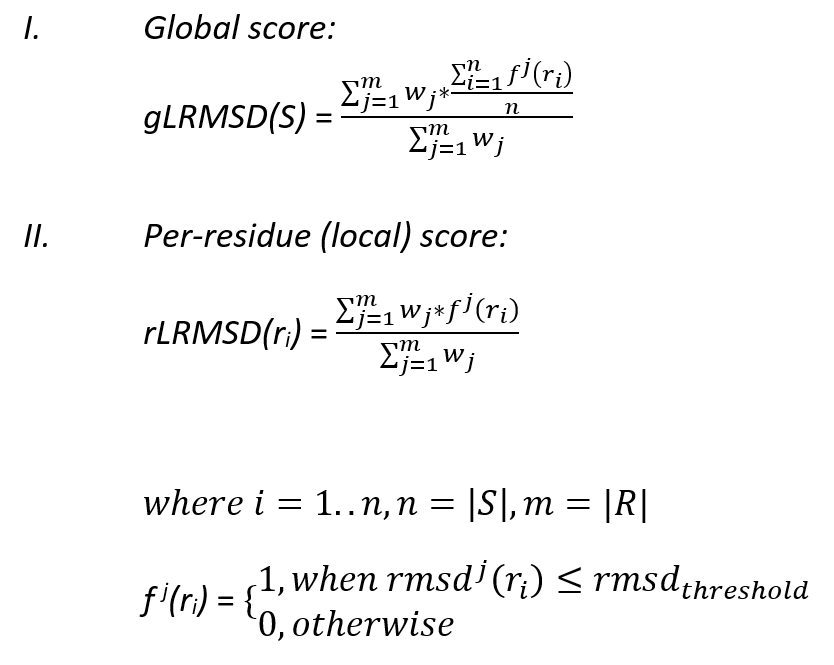

# LRMSD: global/local quality scores of 3D structures of biological molecules within the context of the reference structure

The proposed tool allows users to compute two measures, describing the accuracy of 3D predictions within the context of the native structure from both global and local perspectives, represented by the following equations: .
It supports 3D structures of nucleic acids, proteins, and their complexes. Tertiary structures can be introduced in both PDB and PDBx/mmCIF formats. The resultant scores are normalized in the range <0.0; 100.0>. The higher the score the better quality (i.e., the higher compatibility to the native).

## Installation

The installation of the tool is straightforward and can be easily accomplished with the following ways:

### With Conda via creating a custom environment

**First Conda must be installed:** [official Conda installation guide](https://docs.conda.io/projects/conda/en/latest/user-guide/install/index.html).

After successful installation of conda, the following commands must be executed:

```bash
cd lrmsd
conda create -n lrmsd-env python=3.8
conda activate lrmsd-env
pip install -r requirements.txt
```

### Without Conda

Execute the following commands:

```bash
cd lrmsd
python3 -m pip install -r requirements.txt
```

### Run example usage scenarios (Windows)

Execute the following commands to generate an output for RNA, protein, and RNP examples considered:

```bash
cd lrmsd
./run_tests_only.bat
```

### Run example usage scenarios (Linux/Mac)

Execute the following commands to generate an output for RNA, protein, and RNP examples considered:

```bash
cd lrmsd
chmod u+x run_tests_only.sh
./run_tests_only.sh
```

### Run example usage scenarios and save substructures in PDB format (Windows)

Execute the following commands to generate an output for RNA, protein, and RNP examples considered:

```bash
cd lrmsd
./run_tests_and_save_substructures.bat
```

### Run example usage scenarios and save substructures in PDB format (Linux/Mac)

Execute the following commands to generate an output for RNA, protein, and RNP examples considered:

```bash
cd lrmsd
chmod u+x run_tests_and_save_substructures.sh
./run_tests_and_save_substructures.sh
```

### Manual

The tool provides the following configuration parameters:

```
 -t,--target_path <arg>                              a path of either reference structure 
                                                     PDB/CIF file or directory that 
                                                     includes several native structures.
 -m,--model_path <arg>                               a path of either 3D model PDB/CIF file 
                                                     or directory that includes several 
                                                     models.
 -a,--central_atoms <arg>                            (optional) residue central atom names 
                                                     (separated by ',') [default="CA,C1'"].
 -r,--sphere_radii <arg>                             (optional) sphere radii considered 
                                                     (separated by ',') [default="2.0,3.0,
                                                     4.0,5.0,6.0,7.0,8.0,9.0,10.0,11.0,
                                                     12.0,13.0,14.0,15.0,16.0,17.0,18.0,
                                                     19.0,20.0,22.0,24.0,26.0,28.0,30.0,
                                                     32.0,34.0,36.0,38.0,40.0"].
 -d,--rmsd_threshold <arg>                           (optional) RMSD-based cut-off 
                                                     [default=5A].
 -s,--save_structures                                (optional) flag indicates that all 
                                                     sphere substructures considered will 
                                                     be saved into independent PDB files. 
                                                     [default=off].
```

## Output

The resultant CSV files are generated for: every reference 3D structure and each 3D model considered.

For each native 3D structure and residue central atom used:
- a global ranking of 3D models considered is prepared (e.g., `R1107_D_1292119758_model-annotate_P1human_C1'_gLRMSD.csv`).
- a per-residue neighborhood ranking of 3D models considered is prepared (e.g., `R1107_D_1292119758_model-annotate_P1human_C1'_rLRMSD.csv`).

For every pair of (3D model, native 3D structure) and residue central atom used: 
- a global (whole molecule) score is stored (e.g., `R1107_D_1292119758_model-annotate_P1human_R1107TS029_1_C1'-gLRMSD.csv`).
- a per-residue neighborhood scores are stored (e.g., `R1107_D_1292119758_model-annotate_P1human_R1107TS029_1_C1'-rLRMSD.csv`).
- a detailed matrix based on which the aforementioned scores were computed that includes local RMSD scores computed for every pair (residue along the chain, sphere radius) considered (e.g., `R1107_D_1292119758_model-annotate_P1human_R1107TS029_1_C1'-details.csv`). Moreover, for every sphere radius and every residue along the chain independently mean and standard deviation are also computed.

Optionally on demand of the user, all sphere substructures considered can be also saved into independent files in the PDB format.

### Acknowledgements

We thank Prof. Eric Westhof and Prof. Krzysztof Fidelis for sharing ideas and discussions.

License
----
Copyright (c) 2017 PUT Bioinformatics Group, licensed under [MIT license] [mit].

[mit]: http://opensource.org/licenses/mit-license.php
